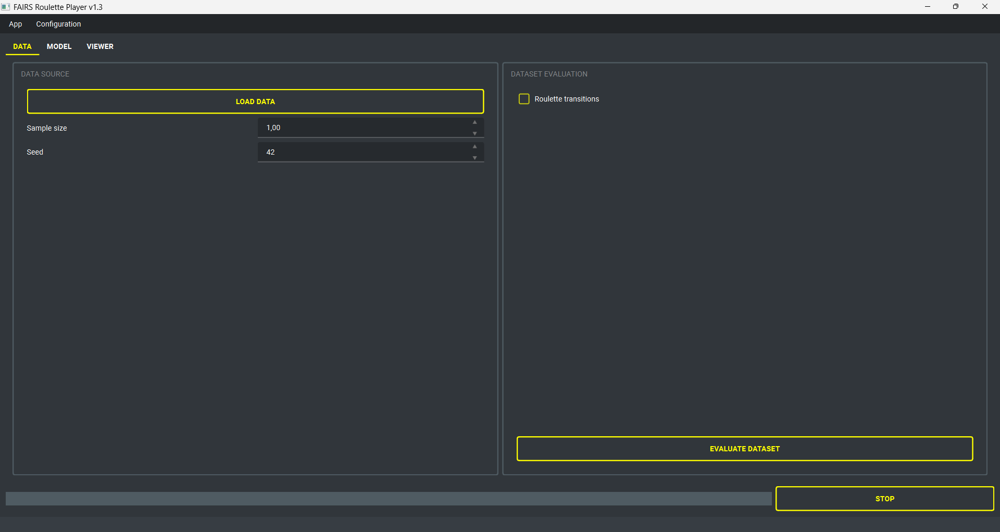
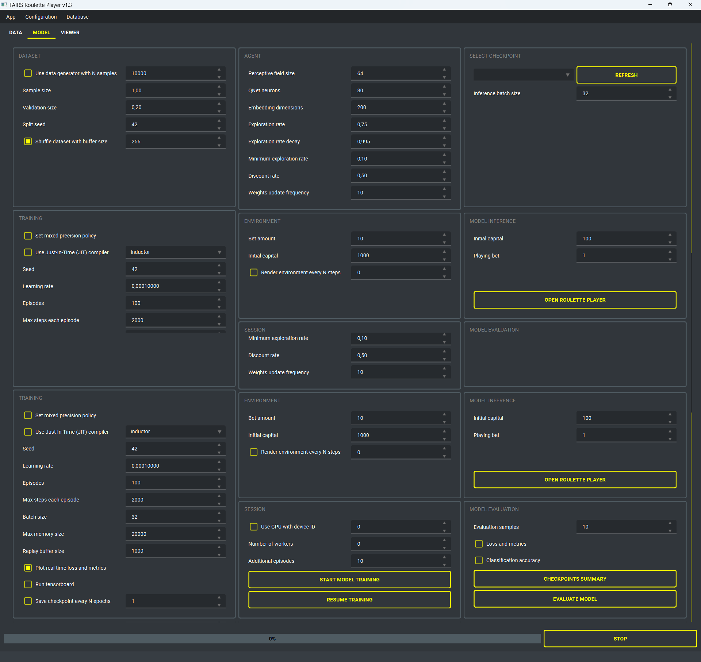
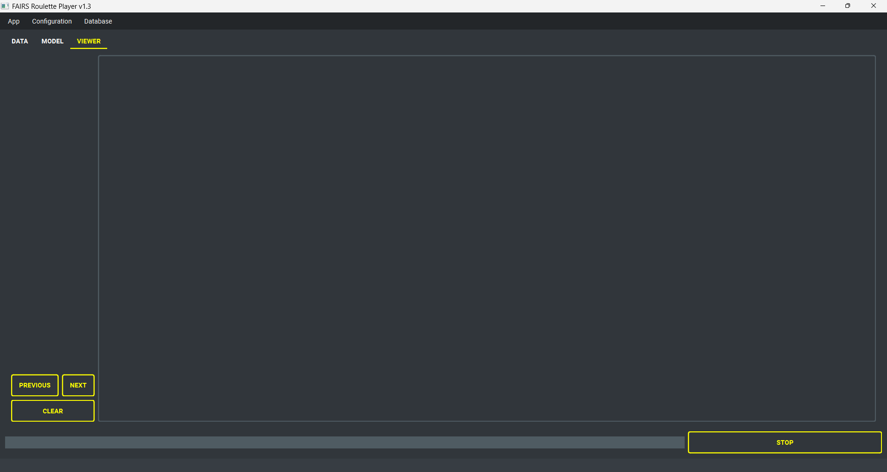

# FAIRS: Fabulous Automated Intelligent Roulette System

## 1. Introduction
FAIRS is a research project dedicated to predicting upcoming outcomes in online roulette through a Deep Q-Network (DQN) agent. Instead of relying solely on immediate, isolated results, FAIRS utilizes sequences of past roulette spins, incorporating a perceptive field of historical outcomes as input. This approach allows the model to detect temporal patterns that might influence future events. Additionally, random number generation can be used to simulate a genuinely unpredictable game environment, mirroring the behavior of a real roulette wheel.

During training, the DQN agent learns to identify patterns within these sequences, and to select the actions associated with the highest Q-scores-signals of potentially more rewarding decisions. In doing so, FAIRS adapts sequence modeling techniques to the inherently random and structured nature of roulette outcomes, aiming to refine predictive accuracy in an environment defined by uncertainty.

## 2. FAIRSnet model
FAIRSnet is a specialized neural network designed for roulette prediction within reinforcement learning contexts. Its core objective is forecasting the action most likely to yield the highest reward by analyzing the current state of the game, represented by a predefined series of recent outcomes (the perceived field). The model learns through interactions with the roulette environment, exploring multiple strategic betting options, including:

- Betting on a specific number (0–36)
- Betting on color outcomes (red or black)
- Betting on numerical ranges (high or low)
- Betting on specific dozen ranges
- Choosing to abstain from betting and exit the game

While roulette outcomes are theoretically random, some online platforms may use algorithms that exhibit patterns or slight autoregressive tendencies. The model is trained on a dataset built from past experiences, using reinforcement learning to optimize decision-making through DQN policy. The Q-Network head predicts Q-values that represents the confidence level for each possible outcome (suggested action). The model is trained using the Mean Squared Error (MSE) loss function, while tracking the Mean Absolute Percentage Error (MAPE) as a key metric. 

The application currently ships with the following functional blocks:

- **Dataset ingestion and validation:** CSV sources are imported into the embedded SQLite database, then profiled through descriptive statistics, transition matrices, sparsity checks, and consistency rules.
- **Training services:** Automatic preprocessing (roulette-wheel encoding, train/validation split, shuffling, synthetic sample generation) feeds the FAIRSnet agent. Training can start from scratch or resume from checkpoints, with support for learning-rate tuning, epsilon-greedy exploration scheduling, replay-buffer sizing, and TensorBoard logging.
- **Inference console:** Any stored checkpoint can be loaded for batched predictions or interactive roulette sessions that simulate capital, bet sizing, and exit strategies.
- **Evaluation dashboards:** Classification accuracy, sparse categorical loss, and custom metrics are computed on demand, producing structured reports and checkpoint summaries for auditing.
- **Viewer tools:** Real-time renders of the simulated roulette environment and historical training charts are accessible through the Viewer tab, enabling quick diagnosis of convergence issues.
- **Configuration management:** All UI controls are backed by the configuration service, making it easy to persist, reload, and share experiment presets.

## 3. Installation
The project targets Windows 10/11 and requires roughly 2 GB of free disk space for the embedded Python runtime, dependencies, checkpoints, and datasets. A CUDA-capable NVIDIA GPU is recommended but not mandatory. Ensure you have the latest GPU drivers installed when enabling TorchInductor + Triton acceleration.

1. **Download the project**: clone the repository or extract the release archive into a writable location (avoid paths that require admin privileges).
2. **Configure environment variables**: copy `FAIRS/resources/templates/.env` into `FAIRS/setup/.env` and adjust values (e.g., backend selection).
3. **Run `start_on_windows.bat`**: the bootstrapper installs a portable Python 3.12 build, downloads Astral’s `uv`, syncs dependencies from `pyproject.toml`, prunes caches, then launches the UI through `uv run`. The script is idempotent—rerun it any time to repair the environment or re-open the app.

Running the script the first time can take several minutes depending on bandwidth. Subsequent runs reuse the cached Python runtime and only re-sync packages when `pyproject.toml` changes.

### 4.1 Just-In-Time (JIT) Compiler
`torch.compile` is enabled throughout the training and inference pipelines. TorchInductor optimizes the computation graph, performs kernel fusion, and lowers operations to Triton-generated kernels on NVIDIA GPUs or to optimized CPU kernels otherwise. Triton is bundled automatically so no separate CUDA toolkit installation is required.

### 4.2 Manual or developer installation
If you prefer managing Python yourself (for debugging or CI):

1. Install Python 3.12.x and `uv` (https://github.com/astral-sh/uv).
2. From the repository root run `uv sync` to create a virtual environment with the versions pinned in `pyproject.toml`.
3. Copy `.env` as described earlier and ensure the `KERAS_BACKEND` is set to `torch`.
4. Launch the UI with `uv run python FAIRS/app/app.py`.

## 5. How to use
Launch the application by double-clicking `start_on_windows.bat` (or via `uv run python FAIRS/src/app/app.py`). On startup the UI loads the last-used configuration, scans the resources folder, and initializes worker pools so long-running jobs (training, inference, validation) do not block the interface.

1. **Prepare data**: verify that `resources/database/dataset` (training) and `resources/database/inference` (inference) contain the expected files. 
2. **Adjust configuration**: use the toolbar to load/save configuration templates or modify each parameter manually from the UI.
3. **Run a pipeline**: pick an action under the Data, Model, or Viewer tabs. Progress bars, log panes, and popup notifications keep you informed. Background workers can be interrupted at any time.

On Windows, run `start_on_windows.bat` to launch the application. Please note that some antivirus software, such as Avast, may flag or quarantine python.exe when called by the .bat file. If you encounter unusual behavior, consider adding an exception in your antivirus settings.

The main interface streamlines navigation across the application's core services, including dataset evaluation, model training and evaluation, and inference. Users can easily visualize generated plots and browse both training and inference images. Model training supports customizable configurations and also allows resuming previous sessions using pretrained models.

**Dataset tab (ingestion, profiling, validation):**
- Import CSV streams into the SQLite backend with a single click (`Load data`), optionally limiting sample size and seeding random shuffles for deterministic experiments.
- Trigger the validation pipeline to compute descriptive stats, roulette transitions, outlier detection, and quality gates. Metrics are saved under `resources/database/validation` for later review.
- Export or delete data directly from the menu bar actions without leaving the UI.

**Model tab (training, inference, evaluation):**
- Configure data generation, train/validation splits, augmentation, and batching behavior before launching a new training run.
- Fine-tune the FAIRSnet agent by adjusting perceptive field size, embedding dimensions, exploration schedule, and optimization parameters from the Training and Agent sections.
- Enable optional services such as TensorBoard streaming, real-time history callbacks, GPU selection, mixed precision, and TorchInductor compilation to match your hardware.
- Resume a checkpointed run, refresh the checkpoint list, and generate summary reports that include loss/accuracy snapshots plus metadata (episodes, replay buffer size, etc.).
- Execute inference in two modes: batch predictions for stored samples or the interactive Roulette console that simulates bets, capital depletion, and exit conditions in real time.
- Evaluate checkpoints with accuracy, sparse categorical loss, confusion summaries, and optional detailed reports ready to share with collaborators.

**Viewer tab:** visualization hub.
- Browse plots generated during dataset or model evaluation, and real-time roulette enviornment rendering
- Useful for quick sanity checks without leaving the application.

### 5.1 Setup and Maintenance
`setup_and_maintenance.bat` launches a lightweight maintenance console with these options:

- **Update project**: performs a `git pull` (or fetches release artifacts) so the local checkout stays in sync.
- **Remove logs**: clears `resources/logs` to save disk space or to reset diagnostics before a new run.
- **Open tools**: quick shortcuts to DB Browser for SQLite or other external utilities defined in the script.

### 5.2 Resources
This folder organizes data and results across various stages of the project, such as data validation, model training, and evaluation. By default, all data is stored within an SQLite database; however, users have the option to export data into separate CSV files if desired. To visualize and interact with SQLite database files, we recommend downloading and installing the DB Browser for SQLite, available at: https://sqlitebrowser.org/dl/. The directory structure includes the following folders:

- **checkpoints:**  pretrained model checkpoints are stored here, and can be used either for resuming training or performing inference with an already trained model.

- **database:** collected adsorption data, processed data and validation results will be stored within the embedded SQLite database. Validation outputs will be saved separately within *database/validation*. Data used for inference with a pretrained checkpoint is located in *database/inference* (a template of the expected dataset columns is available at *resources/templates/FAIRS_predictions.csv*). 

- **logs:** log files are saved here

- **templates:** reference template files can be found here

Environmental variables reside in `FAIRS/setup/.env`. Copy the template from `resources/templates/.env` and adjust as needed:

| Variable              | Description                                                               |
|-----------------------|---------------------------------------------------------------------------|
| KERAS_BACKEND         | Backend for Keras 3; keep `torch` unless you explicitly need TensorFlow.  |
| TF_CPP_MIN_LOG_LEVEL  | Controls TensorFlow logging verbosity (set to `2` to suppress INFO logs). |
| MPLBACKEND            | Matplotlib backend; `Agg` keeps plotting headless for worker threads.     |

## 6. License
This project is licensed under the terms of the MIT license. See the LICENSE file for details.

## Disclaimer
This project is for educational purposes only. It should not be used as a way to make easy money, since the model won't be able to accurately forecast numbers merely based on previous observations!
